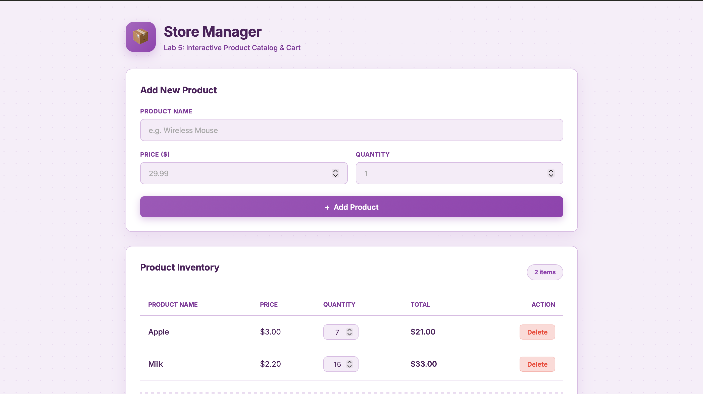

# DOM Store — Lab 5

Student: Marzhan Orynbek  
Repository: `dom-store-marzhan`

# 🛒 Online Store — Product Management System

This project is a dynamic web application designed for adding products, updating quantities, deleting items, and automatically calculating totals in real time.

## 📱 Application Preview

## 🔗 Live Demo

🌐 **View Project:** [dom-store-marzhan](https://marzhanorinbek5-netizen.github.io/dom-store-marzhan/)

---

## 🛠 Tech Stack

* **HTML5** — Semantic structure
* **CSS3** — Modern purple gradient design (CSS Variables, Flexbox, CSS Grid, animations)
* **JavaScript (ES6+)** — Dynamic UI rendering and DOM manipulation

---

## ✨ Features

- [x] Add new products (Name, Price, Quantity)
- [x] Real-time form validation and error handling
- [x] Inline quantity adjustment inside the table
- [x] Remove products from the list
- [x] Dynamic calculation of total items and total price
- [x] Fully responsive layout (optimized for mobile and desktop screens)
